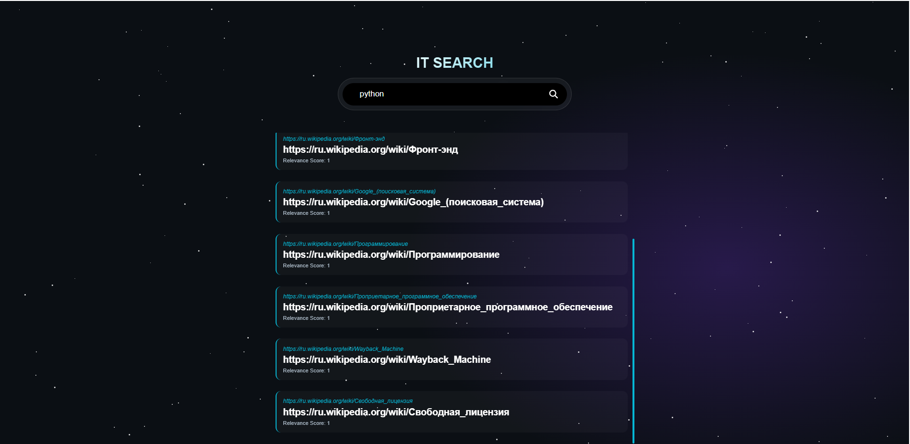

# ?? MySearch: Специализированная поисковая система по IT-отрасли

Дипломный проект в рамках курса «Разработчик на C++». 
Это полнофункциональная поисковая система, состоящая из многопоточного «Паука» (краулера) и высокопроизводительного HTTP-сервера с современным веб-интерфейсом.

## ?? Скриншоты интерфейса

### 1. Главная страница
 

### 2. Результаты поиска
Результаты выводятся мгновенно на той же странице. Реализована система ранжирования по релевантности (частоте упоминания слов).

---

## ?? Технологический стек

*   **Язык**: C++ 17
*   **Сеть**: Boost.Beast, Boost.Asio (HTTP/HTTPS клиент и сервер)
*   **База данных**: PostgreSQL + libpqxx
*   **Многопоточность**: Boost.Asio Thread Pool
*   **Обработка текста**: Boost.Locale (UTF-8, Case-folding)
*   **Безопасность**: OpenSSL
*   **Frontend**: HTML5, CSS3 (Blur effect, Flexbox), JavaScript (Fetch API, Lenis Smooth Scroll)

---
Очень много времени потратил на этот проект, прошу оценить его по достоинству. Заранее спасибо!